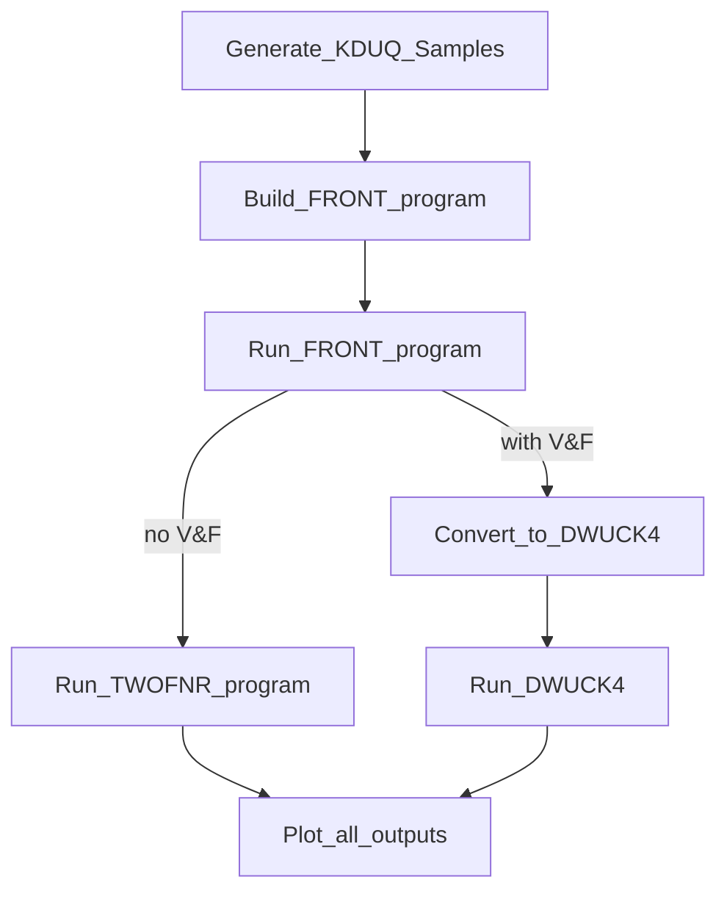

# KDUQ-TWOFNR
Attemting to run KDUQ parameters into TWOFNR for ADWA, then through either TWOFMR or maybe DWUCK4 for use in 19O(d,p) data analysis. 

### Outlining:

working in snakefile:
- [x] Generate KDUQ samples
- [ ] build front program
- [ ] run front program
- [ ] run twofnr program
	- [ ] OR!
		- [ ] convert to dwuck
		- [ ] run dwuck4
- [ ] plot all outputs

